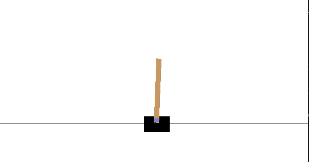

# gym-ddpg-keras

Keras Implementation of DDPG(Deep Deterministic Policy Gradient) with PER(Prioritized Experience Replay) option on OpenAI gym framework

#### Status : [`IMPLEMENTING`](https://github.com/CUN-bjy/gym-ddpg-keras/projects/1)

Extended Work : [`gym-td3-keras`](https://github.com/CUN-bjy/gym-td3-keras)(TD3)

</br>

## Experiments

- *CartPole-v1*, [`link`](https://github.com/CUN-bjy/gym-ddpg-keras/issues/16)

  

  

- *RoboschoolInvertedPendulum-v1*, [`link`](https://github.com/CUN-bjy/gym-ddpg-keras/issues/23)

  

  

  

- *RoboschoolHopper-v1*, [`link`](https://github.com/CUN-bjy/gym-ddpg-keras/issues/24)

  

  

  

---

#### Details from paper

We used **Adam** (Kingma & Ba, 2014) for learning the neural network parameters with a **learning rate of 10−4 and 10−3** for the actor and critic respectively. For Q we included **L2 weight decay of 10−2** and used a **discount factor of γ = 0.99**. For the soft target updates we used **τ = 0.001**. The neural networks used the **rectified non-linearity (Glorot et al., 2011) for all hidden layers**. The final output layer of the actor was a **tanh** layer, to bound the actions. The low-dimensional networks had 2 hidden layers with **400 and 300** units respectively (≈ 130,000 parameters). Actions were not included until the 2nd hidden layer of Q.

#### abstract

- optimizer : Adam
- learning rate: 10-4 ~ 10-3
- weight decay: 10-2 (for regularization)
- discount factor: 0.99(for q-network)
- tau : 0.001 (for soft target update)
- activation : ReLU(for hidden layer), tanh(for output layer)
- layers: 400, 300 for each hidden layer
  </br>

## Easy Installation

1. Make an independent environment using `virtualenv`

```bash
# install virtualenv module
sudo apt-get install python3-pip
sudo pip3 install virtualenv

# create a virtual environment named venv
virtualenv venv 

# activate the environment
source venv/bin/activate 
```

​	To escape the environment, `deactivate`

2. Install the requirements

```bash
pip install -r requirements.txt
```

3. Run the training node

```python
#trainnig
python train.py
```

</br>

## Reference

[1] *Continuous control with deep reinforcement learning*

```
@misc{lillicrap2015continuous,
    title={Continuous control with deep reinforcement learning},
    author={Timothy P. Lillicrap and Jonathan J. Hunt and Alexander Pritzel and Nicolas Heess and Tom Erez and Yuval Tassa and David Silver and Daan Wierstra},
    year={2015},
    eprint={1509.02971},
    archivePrefix={arXiv},
    primaryClass={cs.LG}
}
```

[`REVIEW`](https://github.com/CUN-bjy/rl-paper-review/blob/master/reviews/DDPG.md) | [`PAPER`](https://arxiv.org/pdf/1509.02971.pdf)

[2] [germain-hug/Deep-RL-Keras](https://github.com/germain-hug/Deep-RL-Keras)

[3] [anita-hu/TF2-RL](https://github.com/anita-hu/TF2-RL)

[4] [marload/DeepRL-TensorFlow2](https://github.com/marload/DeepRL-TensorFlow2)

[5] [openai/baselines](https://github.com/openai/baselines)

[6] [Improving DDPG via Prioritized Experience Replay](https://cardwing.github.io/files/RL_course_report.pdf)
